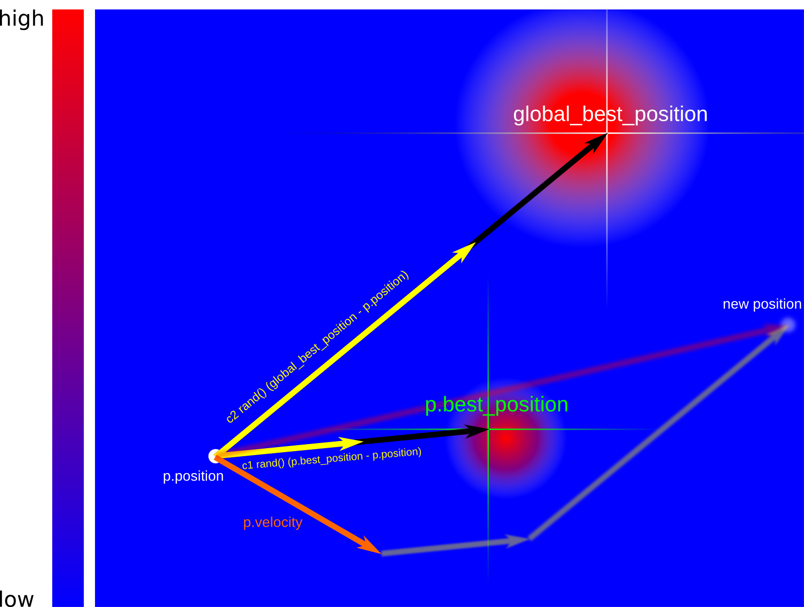
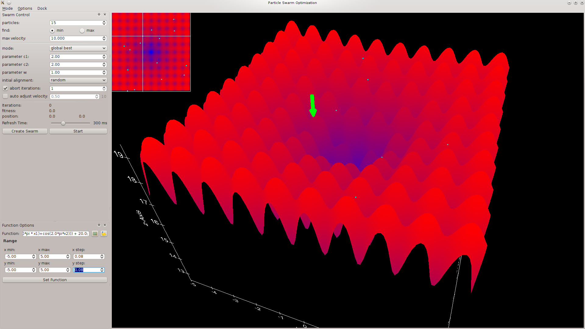
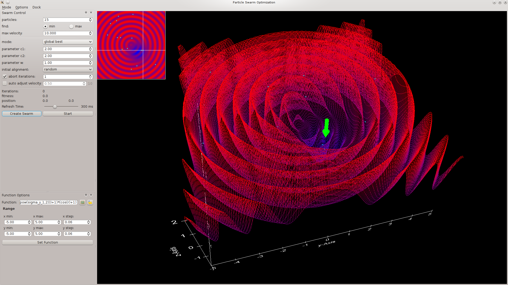
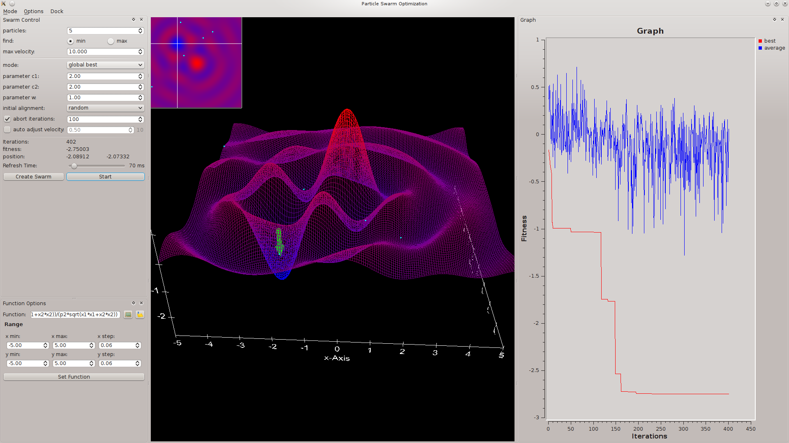

# Particle Swarm Optimization
## Introduction
Particle swarm optimization is a method inspired by swarms of animals like fish or birds. The problem is optimized by using a population of test particles. These particles are moving through the search space accordingly to a simple mathematic formula. This formula depends on the position, velocity and fitness of the current particle as well as of the known best position of all particles. Even more dependencies are possible like the best position in the neighborhood of a particle. For more information have a look at [Particle Swarm Optimization](https://en.wikipedia.org/wiki/Particle_swarm_optimization) on Wikipedia.

## Methode
The parameter space (search space) of the optimization problem is generally  dimensional. This means the particles are moving in the  dimensional space which implies that position and velocity are vectors of this dimension. In general we need to know the following properties from a particle to compute the movement (the new position).

### Particle properties
All positions and velocities are -dimensional vectors, the fitness is in contrast is a plain number. The scope describes if the property belongs to a single particle or to all particles in the swarm.

scope   | property             | description
--------|----------------------| ------------------------------------------------
local   | fitness              | function value at the current position
local   | position             | current position
local   | velocity             | current velocity
local   | best position        | best position ever found by this particle
global  | global best position | best position which was ever found by a particle

To compute the new velocity and position for the particle  the following expressions are used:
<p align="center"></p>

The variables ,  and  are parameters to change/improve the convergence of the method. The function  returns a random float point number between zero and one. 

The following picture illustrates how the new position of the particle  is computed. For simplicity the current position of the particle is also the origin of the coordinate system.



## Modified Methode
A modification of the described method is to include the best position of a neighbor of . This position is in the following called neighbor\_best\_position and is a property of each particle . It is computed by searching for the particle with the best fitness inside a sphere with the radius  around the particle . The velocity of particle  is then computed by the expression:

<p align="center"></p>
This introduces the new parameter  to scale the newly added term in the expression. A further parameter is the radius  of the neighbor sphere.

# Application
The application implements two different methods. The first method is to visualize the swarm optimization for a three dimensional function. The second mode gives the ability to variate a couple of parameters, which is not limited to three dimensions. As a result the fitness and the number of iteration is plotted against the variated parameter.

Some screenshots of the application in visualization mode are shown below.





## Requirements
To compile the source code some library are required. The version numbers given in the listing are the current tested versions of the libraries.

* [Qt framework](http://qt-project.org/) version 4.8.7 (with OpenGL support for QGLWidget)
* [Qwt](http://qwt.sourceforge.net/) version 6.1.3  (Qt Widgets for Technical Applications)
* [muParser](http://muparser.beltoforion.de/) version 2.2.5 (a fast math parser library)
* [Freetype](http://www.freetype.org) version 2.8
* [FTGL](http://sourceforge.net/projects/ftgl/) version 2.1.3 (library to render fonts in OpenGL)

Required programs to build the source:
* [CMake](http://www.cmake.org/) version 3.8
* [make](http://www.gnu.org/software/make/) version 4.2.1
* [gcc](http://www.gnu.org/software/gcc/) version 6.3.1

It is necessary to use gcc as compiler because of some gcc specific features are used in the class Subprocess. The rest of the source is independent of the compiler.

## License
The code is provided under the [GPL v2.0](http://www.gnu.org/licenses/gpl-2.0.html) licence.

## Build Instructions
To build the code first download and install all required libraries and tools. If linux is used most of the libraries and tools can be installed over the packet manager of the used distribution. Note the code is only tested on linux it should in principle work under Windows or MacOS but it is not tested.

In the command listing the ">" character specifies commands, lines without it shows only output.

```bash
> git clone https://github.com/kolb-stefan/particle_swarm_optimization.git
```

In the next step the dependencies are checked and the needed makefiles are created.

```bash
> cd particle_swarm_optimization
> mkdir build
> cd build
> cmake ../     
-- The C compiler identification is GNU 6.3.1
-- The CXX compiler identification is GNU 6.3.1
-- Check for working C compiler: /usr/bin/cc
-- Check for working C compiler: /usr/bin/cc -- works
-- Detecting C compiler ABI info
-- Detecting C compiler ABI info - done
-- Detecting C compile features
-- Detecting C compile features - done
-- Check for working CXX compiler: /usr/bin/c++
-- Check for working CXX compiler: /usr/bin/c++ -- works
-- Detecting CXX compiler ABI info
-- Detecting CXX compiler ABI info - done
-- Detecting CXX compile features
-- Detecting CXX compile features - done
-- Looking for Q_WS_X11
-- Looking for Q_WS_X11 - found
-- Looking for Q_WS_WIN
-- Looking for Q_WS_WIN - not found
-- Looking for Q_WS_QWS
-- Looking for Q_WS_QWS - not found
-- Looking for Q_WS_MAC
-- Looking for Q_WS_MAC - not found
-- Found Qt4: /usr/bin/qmake-qt4 (found version "4.8.7") 
-- Found Qwt: /usr/lib/libqwt.so
-- Found OpenGL: /usr/lib/libGL.so  
-- Found Freetype: /usr/lib/libfreetype.so (found version "2.8.0") 
-- Found FTGL: /usr/lib/libftgl.so  
-- Found muParser: /lib/libmuparser.so  
-- Configuring done
-- Generating done
-- Build files have been written to: /home/stefan/particle_swarm_optimization/build
```

Now build the code by with the make tool. To use more than one processor for building the program use the -j N option of make where N specifies the number of compiler instances which are used simultaneously.
    
```bash
> make   
[  2%] Generating moc_graphwidget.cxx
[  5%] Generating moc_mainwindow.cxx
[  7%] Generating moc_dockmanager.cxx
[ 10%] Generating moc_dockwidget.cxx
[ 12%] Generating moc_functioneditdialog.cxx
[ 15%] Generating moc_functionmanagerdialog.cxx
[ 17%] Generating moc_functionviewer.cxx
[ 20%] Generating moc_swarmcontrolwidget.cxx
[ 23%] Generating moc_functionoptionswidget.cxx
[ 25%] Generating moc_variationcontrolwidget.cxx
[ 28%] Generating moc_particleviewwidget.cxx
Scanning dependencies of target pso
[ 30%] Building CXX object CMakeFiles/pso.dir/function.cpp.o
[ 33%] Building CXX object CMakeFiles/pso.dir/graphwidget.cpp.o
[ 35%] Building CXX object CMakeFiles/pso.dir/particleviewwidget.cpp.o
[ 38%] Building CXX object CMakeFiles/pso.dir/variationcontrolwidget.cpp.o
[ 41%] Building CXX object CMakeFiles/pso.dir/functionoptionswidget.cpp.o
[ 43%] Building CXX object CMakeFiles/pso.dir/swarmcontrolwidget.cpp.o
[ 46%] Building CXX object CMakeFiles/pso.dir/main.cpp.o
[ 48%] Building CXX object CMakeFiles/pso.dir/mainwindow.cpp.o
[ 51%] Building CXX object CMakeFiles/pso.dir/dockmanager.cpp.o
[ 53%] Building CXX object CMakeFiles/pso.dir/dockwidget.cpp.o
[ 56%] Building CXX object CMakeFiles/pso.dir/exception.cpp.o
[ 58%] Building CXX object CMakeFiles/pso.dir/subprocess.cpp.o
[ 61%] Building CXX object CMakeFiles/pso.dir/functioneditdialog.cpp.o
[ 64%] Building CXX object CMakeFiles/pso.dir/functionmanagerdialog.cpp.o
[ 66%] Building CXX object CMakeFiles/pso.dir/functionviewer.cpp.o
[ 69%] Building CXX object CMakeFiles/pso.dir/particle.cpp.o
[ 71%] Building CXX object CMakeFiles/pso.dir/moc_mainwindow.cxx.o
[ 74%] Building CXX object CMakeFiles/pso.dir/moc_dockmanager.cxx.o
[ 76%] Building CXX object CMakeFiles/pso.dir/moc_dockwidget.cxx.o
[ 79%] Building CXX object CMakeFiles/pso.dir/moc_functioneditdialog.cxx.o
[ 82%] Building CXX object CMakeFiles/pso.dir/moc_functionmanagerdialog.cxx.o
[ 84%] Building CXX object CMakeFiles/pso.dir/moc_functionviewer.cxx.o
[ 87%] Building CXX object CMakeFiles/pso.dir/moc_swarmcontrolwidget.cxx.o
[ 89%] Building CXX object CMakeFiles/pso.dir/moc_functionoptionswidget.cxx.o
[ 92%] Building CXX object CMakeFiles/pso.dir/moc_variationcontrolwidget.cxx.o
[ 94%] Building CXX object CMakeFiles/pso.dir/moc_particleviewwidget.cxx.o
[ 97%] Building CXX object CMakeFiles/pso.dir/moc_graphwidget.cxx.o
[100%] Linking CXX executable pso
[100%] Built target pso
```
**Note:** To use the application with all features it is necessary to copy the data directory form the archive into the folder of the executable (pso). The directory contains a font used to draw the axis as well as the list of expression. If the font is not found by the application the axis are not shown.

If no error occurred  the application can be started by typing:

```bash
> cd ..
> build/pso
```